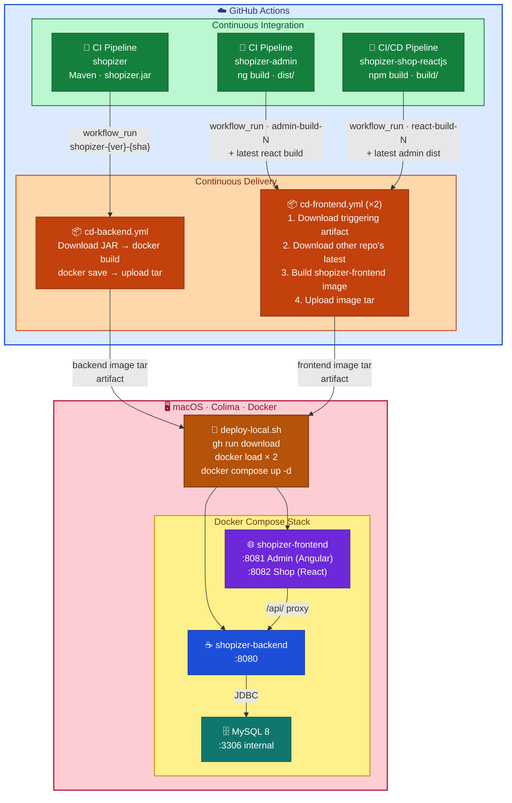

# Shopizer – Local CD with Docker + Colima

> **Scope**: macOS · Colima · Docker Compose · GitHub Actions · No Kubernetes · No cloud.

---

## IaC Provisioning (Recommended)

The repository ships a complete **Infrastructure-as-Code** layer that provisions
the entire local environment — Colima VM, Docker context, tool dependencies, and
the application stack — from a single command.

```
infra/
├── colima.yaml    ← Colima VM specification (CPU, memory, disk, arch, runtime)
└── Brewfile       ← Homebrew tool manifest (colima, docker, gh, jq, …)

provision.sh       ← Idempotent full-stack provisioner (entry point)
teardown.sh        ← Graceful teardown (containers → VM → destroy)
status.sh          ← Live health dashboard  (./status.sh)
```

### First-time setup (single command)

```bash
cd shopizer-infra
./provision.sh
```

This will:

1. Detect macOS + architecture
2. Install all CLI tools via `infra/Brewfile` (`brew bundle`)
3. Copy `infra/colima.yaml` to the **`shopizer` Colima profile** (`~/.colima/shopizer/`)
4. Start the Colima VM (`colima start shopizer`) with the declared specs
5. Set the Docker context to `colima-shopizer`
6. Initialise `deployment/.env` from `.env.example` (if absent)
7. Detect whether images are loaded; pull from GitHub Actions if needed
8. Run `docker compose up -d` in `deployment/`
9. Wait for the backend health check and print all service URLs

The script is **idempotent** — running it again reconciles any drift without
disrupting a running stack.

### Common operations

| Goal | Command |
|---|---|
| Full first-time setup | `./provision.sh` |
| Already have images locally | `./provision.sh --skip-images` |
| Skip Homebrew install | `./provision.sh --skip-brew` |
| Provision VM only, no app | `./provision.sh --only-infra` |
| Apply updated `colima.yaml` | `./provision.sh --reconfigure` |
| Check stack health | `./status.sh` |
| Machine-readable health | `./status.sh --json` |
| Stop containers, keep VM | `./teardown.sh` |
| Stop containers + wipe data | `./teardown.sh --volumes` |
| Stop containers + pause VM | `./teardown.sh --stop-colima` |
| Full destroy (reclaim disk) | `./teardown.sh --destroy-vm -y` |

### VM specification (`infra/colima.yaml`)

The Colima VM is declared in `infra/colima.yaml` and versioned with the repo.
Edit it to tune resources, then apply with `./provision.sh --reconfigure`.

| Setting | Default | Notes |
|---|---|---|
| `cpu` | `2` | vCPU cores; increase to 4 for parallel Maven builds |
| `memory` | `4` | GiB; 6 GiB recommended for concurrent builds |
| `disk` | `60` | GiB; do **not** shrink a running profile |
| `arch` | `host` | Auto-detects (aarch64 on Apple Silicon, x86_64 on Intel) |
| `vmType` | `qemu` | Change to `vz` on macOS 13+ for faster I/O |
| `mountType` | `sshfs` | Change to `virtiofs` with `vmType: vz` |
| `runtime` | `docker` | Do not change |

### Tool dependencies (`infra/Brewfile`)

All CLI tools are declared in `infra/Brewfile`.  Apply independently with:

```bash
brew bundle --file infra/Brewfile
```

| Tool | Purpose |
|---|---|
| `colima` | Lightweight macOS container runtime (replaces Docker Desktop) |
| `docker` | Docker CLI |
| `docker-compose` | Compose v2 plugin |
| `gh` | GitHub CLI (downloads CI image artifacts) |
| `jq` | JSON processor |
| `wget` | Used in Docker healthchecks |

---

## 0. Quick-Start (Local Dev Compose)

The root [`docker-compose.yml`](docker-compose.yml) is the fastest way to run the **complete Shopizer stack** on your machine using images built from the individual repo scripts.

### Step 1 — Build each image

```bash
# From the root of your shopizer-repo checkout:
cd shopizer              && ./build-image-from-ci.sh <github-owner> shopizer
cd ../shopizer-admin        && ./build-image-from-ci.sh <github-owner> shopizer-admin
cd ../shopizer-shop-reactjs && ./build-image-from-ci.sh <github-owner> shopizer-shop-reactjs
```

This produces three local images: `shopizer:ci-latest`, `shopizer-admin:ci-latest`, and `shopizer-shop-reactjs:ci-latest`.

### Step 2 — Start all services

```bash
cd shopizer-infra
docker compose up -d
```

### Service URLs

| Service | URL |
|---|---|
| Backend (Swagger UI) | http://localhost:8080/swagger-ui.html |
| Backend (Health) | http://localhost:8080/actuator/health |
| Admin UI (Angular) | http://localhost:4200 |
| React Shop | http://localhost:3000 |
| MySQL | `localhost:3306` (internal only) |

### Default credentials

| Role | Email | Password |
|---|---|---|
| Admin | `admin@shopizer.com` | `password` |
| Customer | `john.doe@example.com` | `password123` |

### Environment variables

All env vars in `docker-compose.yml` are sensible defaults. Override them inline or with a `.env` file:

| Variable | Service | Default | Notes |
|---|---|---|---|
| `APP_BASE_URL` | admin, react | `http://localhost:8080[/api]` | Must be browser-reachable |
| `APP_MERCHANT` | react | `DEFAULT` | Merchant code |
| `APP_PAYMENT_TYPE` | react | `STRIPE` | `STRIPE` or `NUVEI` |
| `APP_STRIPE_KEY` | react | _(empty)_ | Your Stripe publishable key |
| `APP_DEFAULT_LANGUAGE` | admin | `en` | UI language |

### Stop / tear down

```bash
# Stop all containers (keep data)
docker compose stop

# Remove containers (keep volumes)
docker compose down

# Full reset including MySQL data
docker compose down -v
```

> **Difference from `deployment/docker-compose.yml`**: The root compose uses images built by the per-repo `build-image-from-ci.sh` scripts (tagged `ci-latest` / `local-latest`) and is intended for local development and testing. The `deployment/` compose is the artifact-based CD stack used by the full `deploy-local.sh` pipeline with versioned image tags.

---

## 1. High-level Architecture



---

## 2. Why Artifact-based Image Builds?

| | Artifact-based (this design) | Rebuild from source in CD |
|---|---|---|
| **What is deployed** | Exact JAR/dist tested by CI | Potentially different binary |
| **Build time** | Seconds (just `docker build`) | Minutes (full compile) |
| **Environment parity** | Guaranteed (same byte sequence) | Risk of env drift |
| **CI/CD separation** | Clean – CI owns code, CD owns delivery | CI and CD are coupled |
| **Simulates production** | Yes – prod also deploys pre-built artifacts | No |

### CI vs CD responsibilities

```
CI (Continuous Integration)           CD (Continuous Delivery)
───────────────────────────           ───────────────────────
• Compile                             • Download CI artifact
• Run unit / integration tests        • Build container image
• Static analysis / lint              • Tag and version the image
• Upload versioned artifact           • Export image as loadable tar
                                      • Start/update local containers
```

---

## 3. Directory Structure

```
infra/
├── colima.yaml                ← IaC: Colima VM specification (CPU/memory/disk/arch)
└── Brewfile                   ← IaC: Homebrew tool manifest (brew bundle)

provision.sh                   ← Idempotent full-stack provisioner  (./provision.sh)
teardown.sh                    ← Graceful teardown at any level      (./teardown.sh)
status.sh                      ← Live health dashboard               (./status.sh)

docker-compose.yml             ← Quick-start compose (ci-latest images)
                                  runs mysql + shopizer + shopizer-admin + shopizer-shop-reactjs

deployment/
├── .env.example                   ← copy to .env and fill in secrets
├── .env                           ← git-ignored; your actual values
├── docker-compose.yml             ← CD pipeline stack (versioned artifact-based images)
├── deploy-local.sh                ← artifact pull + deployment script
├── rollback.sh                    ← tag-switch rollback script
│
├── frontend/                      ← combined Angular admin + React shop
│   ├── Dockerfile                 ← serves admin (8081) and react (8082)  [unique to infra]
│   └── nginx.conf                 ← two server{} blocks; no base-href changes needed
│
└── reference-workflows/           ← copy these to the respective repos
    ├── cd-backend.yml             → shopizer/.github/workflows/cd.yml
    ├── cd-admin.yml               → shopizer-admin/.github/workflows/cd.yml
    └── cd-react.yml               → shopizer-shop-reactjs/.github/workflows/cd.yml
```

---

## 4. Image Tagging Strategy

Every image is tagged three ways simultaneously:

```
shopizer-backend:latest                  ← always points to newest
shopizer-backend:3.2.5                   ← semantic version
shopizer-backend:3.2.5-a1b2c3d4         ← version + short SHA  (canonical)

shopizer-frontend:latest                 ← always points to newest combined build
shopizer-frontend:1.0.0-b2c3d4e5        ← version of the triggering app + its SHA
```

The canonical `{version}-{sha}` tag is what you put in `.env` when deploying
or rolling back. This makes it unambiguous exactly what code is running.

> **Combined frontend tag note**: `shopizer-frontend` is built by a CD workflow
> in whichever frontend repo's CI just completed. The tag uses the version and
> SHA of the **triggering** app (admin or react). The other app's content is
> always the most recent successfully built artifact.

### Version extraction per language

| Image | Source | Extraction |
|---|---|---|
| shopizer-backend | Maven `pom.xml` | `./mvnw help:evaluate -Dexpression=project.version -q -DforceStdout -pl sm-shop` |
| shopizer-frontend (admin side) | `shopizer-admin/package.json` | `node -p "require('./package.json').version"` |
| shopizer-frontend (react side) | `shopizer-shop-reactjs/package.json` | `node -p "require('./package.json').version"` |

---

## 5. Step-by-step Setup

### 5.1 One-time prerequisites

> If you use the IaC provisioner (`./provision.sh`) these steps are automated.
> Follow them manually only if you prefer a hands-on approach.

```bash
# Install Colima + Docker CLI + GitHub CLI via the Brewfile
brew bundle --file infra/Brewfile

# Authenticate GitHub CLI
gh auth login

# Start the 'shopizer' Colima profile (specs from infra/colima.yaml)
colima start shopizer --cpu 2 --memory 4 --disk 60
docker context use colima-shopizer
```

### 5.2 Configure the CD workflow in each repo

1. **shopizer** – already at `.github/workflows/cd-backend.yml`. Fully configured.

2. **shopizer-admin** – copy `reference-workflows/cd-admin.yml` to
   `.github/workflows/cd-frontend.yml` in the admin repo. This workflow
   downloads the admin dist **and** the latest react build, then builds the
   combined `shopizer-frontend` image.

3. **shopizer-shop-reactjs** – copy `reference-workflows/cd-react.yml` to
   `.github/workflows/cd-frontend.yml` in the react repo. This workflow
   downloads the react build **and** the latest admin dist, then builds the
   same combined `shopizer-frontend` image.

   > **CROSS_REPO_TOKEN**: both frontend CD workflows need to download artifacts
   > from the *other* repo. Add a fine-grained PAT (`CROSS_REPO_TOKEN`) to each
   > repo's secrets with **Actions (read)** permission on the counterpart repo.
   > Create at: *Settings → Developer settings → Personal access tokens →
   > Fine-grained tokens*.

   > **CI workflow name must match** `workflow_run.workflows` in the CD file:
   >
   > | Repo | CI workflow name (`name:` in ci.yml) | CD trigger value |
   > |---|---|---|
   > | shopizer | `Shopizer-Backend-CI` | `"Shopizer-Backend-CI"` ✔ |
   > | shopizer-admin | `CI` | `"CI"` ✔ |
   > | shopizer-shop-reactjs | `CI/CD Pipeline` | `"CI/CD Pipeline"` ✔ |

### 5.3 Ensure CI artifact names match

The `cd-frontend.yml` workflow downloads artifacts from **both** CI repos:

| Repo | CI workflow name | CI artifact name | Pattern in CD |
|---|---|---|---|
| shopizer | `CI Pipeline` | `shopizer-{version}-{sha}` | `shopizer-*` |
| shopizer-admin | `CI` | `shopizer-admin-build-{run_number}` | `shopizer-admin-build-*` |
| shopizer-shop-reactjs | `CI/CD Pipeline` | `shopizer-react-build-{run_number}` | `shopizer-react-build-*` |

All CI workflows already upload artifacts matching these patterns. ✔

> **Note on Dockerfiles**: Each source repo owns its own `Dockerfile.ci` (used by its CD workflow
> for standalone images). The **combined frontend** `Dockerfile` lives in
> `shopizer-infra/deployment/frontend/` — it is unique to infra because it serves both Angular admin
> (port 8081) and React shop (port 8082) from a single Nginx container. The CD workflows for admin
> and react checkout the source repo's `Dockerfile.ci` directly; the infra combined Dockerfile is
> used when deploying the full CD stack via `deploy-local.sh`.

### 5.4 Configure deployment environment

```bash
cd deployment
cp .env.example .env
# Edit .env – set passwords and the GitHub repo names
nano .env
```

---

## 6. Local Deployment Commands

### Start the full stack

```bash
# Start Colima (skip if already running)
colima start

# Full deploy – pulls latest image tars from GitHub, loads and starts
cd deployment
./deploy-local.sh
```

### Deploy a specific version

```bash
./deploy-local.sh --backend-tag 3.2.5-a1b2c3d4
```

### Deploy both services at explicit tags

```bash
./deploy-local.sh \
  --backend-tag  3.2.5-a1b2c3d4 \
  --frontend-tag 1.0.0-b2c3d4e5
```

### Skip GitHub download (use already-loaded images)

```bash
./deploy-local.sh --skip-pull
```

### Only restart the backend

```bash
./deploy-local.sh --only-backend --backend-tag 3.2.5-a1b2c3d4
```

---

## 7. Service URLs

| Service | URL |
|---|---|
| Backend (Swagger) | http://localhost:8080/swagger-ui/index.html |
| Backend (Health) | http://localhost:8080/actuator/health |
| Admin UI | http://localhost:8081 |
| React Shop | http://localhost:8082 |
| MySQL | localhost:3306 (internal only) |

---

## 8. Logs Inspection

```bash
# All services, follow
docker compose -f deployment/docker-compose.yml logs -f

# Single service, last 100 lines
docker compose -f deployment/docker-compose.yml logs --tail 100 shopizer-backend

# Check container health status
docker inspect --format='{{.State.Health.Status}}' shopizer-backend
docker inspect --format='{{.State.Health.Status}}' shopizer-mysql
```

---

## 9. Rollback Strategy

### List locally available tags

```bash
cd deployment
./rollback.sh --list
```

Output:
```
Backend (shopizer-backend):
TAG                           CREATED         SIZE
3.2.5-a1b2c3d4                2 hours ago     185MB
3.2.4-9e8d7c6b                1 day ago       183MB
latest                        2 hours ago     185MB
```

### Roll back backend to a previous tag

```bash
./rollback.sh --backend-tag 3.2.4-9e8d7c6b
```

### Roll back the combined frontend

```bash
./rollback.sh --frontend-tag 1.0.0-9e8d7c6b
```

Each rollback:
1. Validates the tag exists locally (no download)
2. Records the current tags in `.rollback-history`
3. Updates `.env`
4. Restarts only the affected service (`docker compose up --no-deps`)

### Manual tag switch (without the script)

```bash
# Switch backend tag in .env
sed -i '' 's/^IMAGE_TAG_BACKEND=.*/IMAGE_TAG_BACKEND=3.2.4-9e8d7c6b/' deployment/.env
docker compose -f deployment/docker-compose.yml up -d --no-deps shopizer-backend

# Switch frontend tag in .env
sed -i '' 's/^IMAGE_TAG_FRONTEND=.*/IMAGE_TAG_FRONTEND=1.0.0-9e8d7c6b/' deployment/.env
docker compose -f deployment/docker-compose.yml up -d --no-deps shopizer-frontend
```

---

## 10. Teardown

Use `teardown.sh` for any level of teardown (see `./teardown.sh --help`):

```bash
# Stop containers, keep volumes and VM (fastest restart)
./teardown.sh

# Stop containers AND wipe all MySQL data
./teardown.sh --volumes

# Stop containers + pause the Colima VM (reclaims ~4 GB RAM)
./teardown.sh --stop-colima

# Complete destroy – removes VM + context + all state (run provision.sh to rebuild)
./teardown.sh --destroy-vm -y
```

Or with raw `docker compose` if you prefer:

```bash
# Stop all containers (keep volumes / data)
docker compose -f deployment/docker-compose.yml stop

# Remove containers (keep volumes)
docker compose -f deployment/docker-compose.yml down

# Remove containers AND all data volumes (full reset)
docker compose -f deployment/docker-compose.yml down -v

# Stop Colima VM entirely
colima stop shopizer
```

---

## 11. CI Artifact Reference (all three repos)

The `cd-frontend.yml` workflow in each frontend repo downloads BOTH artifact
patterns. No changes to the CI workflows are needed.

**shopizer-admin** (`ci.yml` – workflow name `"CI"`):

| Field | Value |
|---|---|
| Artifact name | `shopizer-admin-build-{run_number}` |
| Artifact contents | `shopizer-admin-{sha}.tar.gz` (contains `dist/` contents) |
| Used by CD | `cd-frontend.yml` in admin repo (primary) + react repo (cross-repo) |

**shopizer-shop-reactjs** (`ci-cd.yml` – workflow name `"CI/CD Pipeline"`):

| Field | Value |
|---|---|
| Artifact name | `shopizer-react-build-{run_number}` |
| Artifact contents | `build/` directory (flat, not tarred) |
| Used by CD | `cd-frontend.yml` in react repo (primary) + admin repo (cross-repo) |

> If you adjust artifact naming, update both the `upload-artifact` step in the CI
> workflow **and** the `pattern:` in **both** `cd-frontend.yml` files to stay in sync.

---

## 12. Optional Improvements

### A – Local Docker registry (push instead of tar export)

Running a local registry removes the tar export/download step. Images are
pushed from GitHub Actions self-hosted runner directly to your Mac.

```bash
# Start a local registry on your Mac
docker run -d -p 5000:5000 --restart=always --name local-registry registry:2
```

Then in the CD workflow, replace the `Export image tar` step with:
```yaml
- name: Push to local registry
  run: |
    docker tag shopizer-backend:${{ steps.meta.outputs.image_tag }} \
               localhost:5000/shopizer-backend:${{ steps.meta.outputs.image_tag }}
    docker push localhost:5000/shopizer-backend:${{ steps.meta.outputs.image_tag }}
```

In `docker-compose.yml`:
```yaml
image: localhost:5000/shopizer-backend:${IMAGE_TAG_BACKEND:-latest}
```

> Requires a self-hosted GitHub Actions runner on your Mac to make
> `localhost:5000` reachable from the workflow.

### B – TLS via mkcert (HTTPS locally)

```bash
brew install mkcert nss
mkcert -install
mkcert localhost

# Results in: localhost.pem  localhost-key.pem
# Mount into the shopizer-frontend container and update nginx.conf to listen on 443
```

### C – Self-hosted runner setup (required for CD)

All three CD reference workflows run on **`runs-on: self-hosted`** — they build
images directly into the Colima Docker daemon and run `docker compose up`
without any tar export or manual download step.

**One-time registration** (per repo that has a CD workflow):

```bash
# Go to: GitHub repo → Settings → Actions → Runners → New self-hosted runner
# Choose: macOS  → copy the registration commands and run them in your terminal
# The runner registers as a persistent LaunchAgent service
```

**Required GitHub repo settings** (per repo):

| Setting type | Name | Value / notes |
|---|---|---|
| Variable | `INFRA_DIR` | Absolute path to shopizer-infra on your Mac<br>e.g. `/Users/yourname/workspace/shopizer-infra` |
| Secret | `CROSS_REPO_TOKEN` | Fine-grained PAT with **Actions (read)** on the *other* frontend repo<br>admin repo needs read access on reactjs repo, and vice-versa |

Create the PAT at: *Settings → Developer settings → Personal access tokens →
Fine-grained tokens → Repository access: shopizer-shop-reactjs → Permissions:
Actions → Read-only*.

**Verify runner and Colima are up**:

```bash
# Check runner service
./runsvc.sh status        # or: launchctl list | grep actions.runner

# Check Colima
colima status shopizer
docker context use colima-shopizer
docker info | grep -i "server version"
```

### D – Watchtower (automatic container updates)

```yaml
# Add to docker-compose.yml for automatic rolling updates when
# new images are loaded into the local daemon
watchtower:
  image: containrrr/watchtower
  volumes:
    - /var/run/docker.sock:/var/run/docker.sock
  command: --interval 30 shopizer-backend shopizer-frontend
  restart: unless-stopped
```
