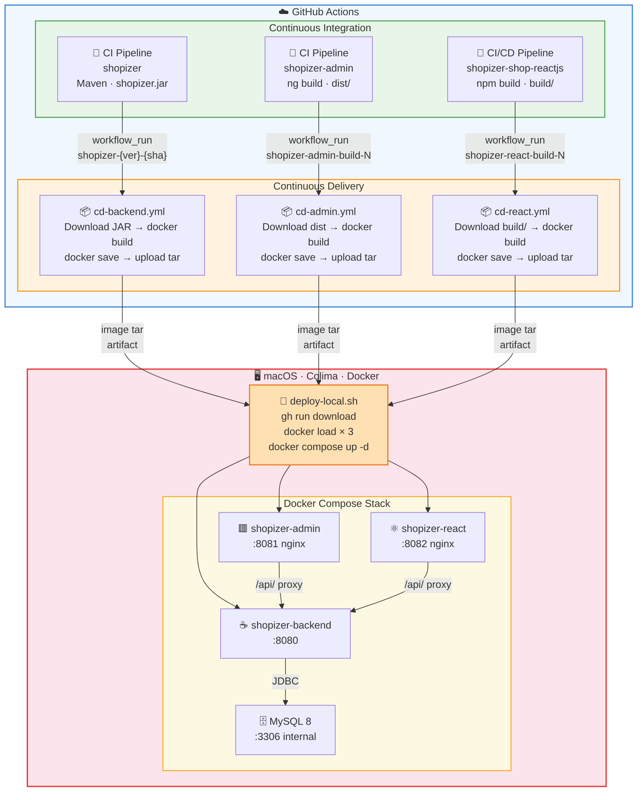

# Shopizer – Local CD with Docker + Colima

> **Scope**: macOS · Colima · Docker Compose · GitHub Actions · No Kubernetes · No cloud.

---

## 1. High-level Architecture



---

## 2. Why Artifact-based Image Builds?

| | Artifact-based (this design) | Rebuild from source in CD |
|---|---|---|
| **What is deployed** | Exact JAR/dist tested by CI | Potentially different binary |
| **Build time** | Seconds (just `docker build`) | Minutes (full compile) |
| **Environment parity** | Guaranteed (same byte sequence) | Risk of env drift |
| **CI/CD separation** | Clean – CI owns code, CD owns delivery | CI and CD are coupled |
| **Simulates production** | Yes – prod also deploys pre-built artifacts | No |

### CI vs CD responsibilities

```
CI (Continuous Integration)           CD (Continuous Delivery)
───────────────────────────           ───────────────────────
• Compile                             • Download CI artifact
• Run unit / integration tests        • Build container image
• Static analysis / lint              • Tag and version the image
• Upload versioned artifact           • Export image as loadable tar
                                      • Start/update local containers
```

---

## 3. Directory Structure

```
deployment/
├── .env.example                   ← copy to .env and fill in secrets
├── .env                           ← git-ignored; your actual values
├── docker-compose.yml             ← unified stack definition
├── deploy-local.sh                ← main deployment script
├── rollback.sh                    ← tag-switch rollback script
│
├── backend/
│   └── Dockerfile                 ← artifact-based; expects shopizer.jar
│
├── admin/
│   ├── Dockerfile                 ← artifact-based; expects dist/
│   └── nginx.conf                 ← SPA routing + API proxy
│
├── react/
│   ├── Dockerfile                 ← artifact-based; expects build/
│   └── nginx.conf                 ← SPA routing + API proxy
│
└── reference-workflows/           ← copy these to the respective repos
    ├── cd-admin.yml               → shopizer-admin/.github/workflows/
    └── cd-react.yml               → shopizer-shop-reactjs/.github/workflows/
```

---

## 4. Image Tagging Strategy

Every image is tagged three ways simultaneously:

```
shopizer-backend:latest                 ← always points to newest
shopizer-backend:3.2.5                  ← semantic version (immutable once pushed)
shopizer-backend:3.2.5-a1b2c3d4        ← version + short SHA  (canonical)
```

The canonical `{version}-{sha}` tag is what you put in `.env` when deploying
or rolling back. This makes it unambiguous exactly what code is running.

### Version extraction per language

| Service | Language | Extraction command |
|---|---|---|
| shopizer | Maven | `./mvnw help:evaluate -Dexpression=project.version -q -DforceStdout -pl sm-shop` |
| shopizer-admin | Node/npm | `node -p "require('./package.json').version"` |
| shopizer-shop-reactjs | Node/npm | `node -p "require('./package.json').version"` |

---

## 5. Step-by-step Setup

### 5.1 One-time prerequisites

```bash
# Install Colima
brew install colima

# Install Docker CLI (no Docker Desktop needed)
brew install docker docker-compose

# Install GitHub CLI
brew install gh
gh auth login        # authenticate once

# Create a Docker context that points to Colima
colima start --cpu 2 --memory 4 --disk 60
docker context use colima
```

### 5.2 Configure the CD workflow in each repo

1. **shopizer** – the CD workflow is already at `.github/workflows/cd-backend.yml`.
   It is fully configured.

2. **shopizer-admin** – the CD workflow is already at `.github/workflows/cd.yml`.
   It is fully configured and references the Dockerfile from shopizer-infra.

3. **shopizer-shop-reactjs** – the CD workflow is already at `.github/workflows/cd-react.yml`.
   It is fully configured and references the Dockerfile from shopizer-infra.

   > **CI workflow name must match**: each CD workflow's `workflow_run.workflows`
   > field must match the exact `name:` of the CI workflow in that repo:
   >
   > | Repo | CI workflow name | CD trigger value |
   > |---|---|---|
   > | shopizer | `CI Pipeline` | `"CI Pipeline"` ✔ |
   > | shopizer-admin | `CI` | `"CI"` ✔ |
   > | shopizer-shop-reactjs | `CI/CD Pipeline` | `"CI/CD Pipeline"` ✔ |

### 5.3 Ensure CI artifact names match

The CD workflows expect these artifact name patterns:

| Repo | CI workflow name | CI artifact upload pattern | CD download pattern |
|---|---|---|---|
| shopizer | `CI Pipeline` | `shopizer-{version}-{sha}` | `shopizer-*` |
| shopizer-admin | `CI` | `shopizer-admin-build-{run_number}` | `shopizer-admin-build-*` |
| shopizer-shop-reactjs | `CI/CD Pipeline` | `shopizer-react-build-{run_number}` | `shopizer-react-build-*` |

All three CI workflows already upload artifacts matching these patterns. ✔

> **Note on Dockerfiles**: All Dockerfiles live in `shopizer-infra` (this repo),
> not in the source repos. Both the admin and react CD workflows automatically
> checkout shopizer-infra using a sparse checkout of
> `shopizer/deployment/admin` and `shopizer/deployment/react` respectively.

### 5.4 Configure deployment environment

```bash
cd deployment
cp .env.example .env
# Edit .env – set passwords and the GitHub repo names
nano .env
```

---

## 6. Local Deployment Commands

### Start the full stack

```bash
# Start Colima (skip if already running)
colima start

# Full deploy – pulls latest image tars from GitHub, loads and starts
cd deployment
./deploy-local.sh
```

### Deploy a specific version

```bash
./deploy-local.sh --backend-tag 3.2.5-a1b2c3d4
```

### Deploy all three at explicit tags

```bash
./deploy-local.sh \
  --backend-tag 3.2.5-a1b2c3d4 \
  --admin-tag   1.1.0-b2c3d4e5 \
  --react-tag   2.3.0-c3d4e5f6
```

### Skip GitHub download (use already-loaded images)

```bash
./deploy-local.sh --skip-pull
```

### Only restart the backend

```bash
./deploy-local.sh --only-backend --backend-tag 3.2.5-a1b2c3d4
```

---

## 7. Service URLs

| Service | URL |
|---|---|
| Backend (Swagger) | http://localhost:8080/swagger-ui/index.html |
| Backend (Health) | http://localhost:8080/actuator/health |
| Admin UI | http://localhost:8081 |
| React Shop | http://localhost:8082 |
| MySQL | localhost:3306 (internal only) |

---

## 8. Logs Inspection

```bash
# All services, follow
docker compose -f deployment/docker-compose.yml logs -f

# Single service, last 100 lines
docker compose -f deployment/docker-compose.yml logs --tail 100 shopizer-backend

# Check container health status
docker inspect --format='{{.State.Health.Status}}' shopizer-backend
docker inspect --format='{{.State.Health.Status}}' shopizer-mysql
```

---

## 9. Rollback Strategy

### List locally available tags

```bash
cd deployment
./rollback.sh --list
```

Output:
```
Backend (shopizer-backend):
TAG                           CREATED         SIZE
3.2.5-a1b2c3d4                2 hours ago     185MB
3.2.4-9e8d7c6b                1 day ago       183MB
latest                        2 hours ago     185MB
```

### Roll back backend to a previous tag

```bash
./rollback.sh --backend-tag 3.2.4-9e8d7c6b
```

This:
1. Validates the tag exists locally (no download)
2. Records the current tags in `.rollback-history`
3. Updates `.env`
4. Restarts only the affected service (`docker compose up --no-deps`)

### Manual tag switch (without the script)

```bash
# Switch backend image tag in .env
sed -i '' 's/^IMAGE_TAG_BACKEND=.*/IMAGE_TAG_BACKEND=3.2.4-9e8d7c6b/' deployment/.env

# Restart only backend (MySQL and frontends stay up)
docker compose -f deployment/docker-compose.yml up -d --no-deps shopizer-backend
```

---

## 10. Teardown

```bash
# Stop all containers (keep volumes / data)
docker compose -f deployment/docker-compose.yml stop

# Remove containers (keep volumes)
docker compose -f deployment/docker-compose.yml down

# Remove containers AND all data volumes (full reset)
docker compose -f deployment/docker-compose.yml down -v

# Stop Colima VM entirely
colima stop
```

---

## 11. CI Artifact Upload Reference (shopizer-admin + shopizer-shop-reactjs)

Both frontend CI workflows already upload artifacts. The CD workflows are already
aligned to download these exact patterns. **No changes needed.**

**shopizer-admin** (`ci.yml` – workflow name `"CI"`):

| Field | Value |
|---|---|
| Artifact name | `shopizer-admin-build-{run_number}` |
| Artifact contents | `shopizer-admin-{sha}.tar.gz` (contains `dist/` contents) |
| CD download pattern | `shopizer-admin-build-*` |

**shopizer-shop-reactjs** (`ci-cd.yml` – workflow name `"CI/CD Pipeline"`):

| Field | Value |
|---|---|
| Artifact name | `shopizer-react-build-{run_number}` |
| Artifact contents | `build/` directory (flat, not tarred) |
| CD download pattern | `shopizer-react-build-*` |

> If you need to adjust artifact naming, update both the `upload-artifact` step
> in the respective CI workflow **and** the `pattern:` in the corresponding CD
> workflow to stay in sync.

---

## 12. Optional Improvements

### A – Local Docker registry (push instead of tar export)

Running a local registry removes the tar export/download step. Images are
pushed from GitHub Actions self-hosted runner directly to your Mac.

```bash
# Start a local registry on your Mac
docker run -d -p 5000:5000 --restart=always --name local-registry registry:2
```

Then in the CD workflow, replace the `Export image tar` step with:
```yaml
- name: Push to local registry
  run: |
    docker tag shopizer-backend:${{ steps.meta.outputs.image_tag }} \
               localhost:5000/shopizer-backend:${{ steps.meta.outputs.image_tag }}
    docker push localhost:5000/shopizer-backend:${{ steps.meta.outputs.image_tag }}
```

In `docker-compose.yml`:
```yaml
image: localhost:5000/shopizer-backend:${IMAGE_TAG_BACKEND:-latest}
```

> Requires a self-hosted GitHub Actions runner on your Mac to make
> `localhost:5000` reachable from the workflow.

### B – Nginx reverse proxy (single entry point)

Adds a single Nginx container that routes everything by path, eliminating
multiple ports:

```yaml
# Add to docker-compose.yml
shopizer-proxy:
  image: nginx:1.25-alpine
  ports:
    - "80:80"
  volumes:
    - ./proxy/nginx.conf:/etc/nginx/nginx.conf:ro
  depends_on:
    - shopizer-backend
    - shopizer-admin
    - shopizer-react
```

```nginx
# deployment/proxy/nginx.conf routing table:
#   /api/*         → shopizer-backend:8080
#   /admin/*       → shopizer-admin:80
#   /              → shopizer-react:80
```

Access everything at `http://localhost`.

### C – TLS via mkcert (HTTPS locally)

```bash
brew install mkcert nss
mkcert -install
mkcert localhost

# Results in: localhost.pem  localhost-key.pem
# Mount into the proxy container and update nginx.conf to listen on 443
```

### D – Self-hosted runner (full automation)

Run a GitHub Actions self-hosted runner on your Mac to make the entire CD
workflow execute locally. Images are built, loaded, and deployed without any
manual `deploy-local.sh` invocation.

```bash
# From your GitHub repo settings → Actions → Runners → New self-hosted runner
# Follow the macOS instructions – registers as a persistent LaunchAgent
```

Change `runs-on: ubuntu-latest` to `runs-on: self-hosted` in all CD workflows.

### E – Watchtower (automatic container updates)

```yaml
# Add to docker-compose.yml for automatic rolling updates when
# new images are loaded into the local daemon
watchtower:
  image: containrrr/watchtower
  volumes:
    - /var/run/docker.sock:/var/run/docker.sock
  command: --interval 30 shopizer-backend shopizer-admin shopizer-react
  restart: unless-stopped
```
